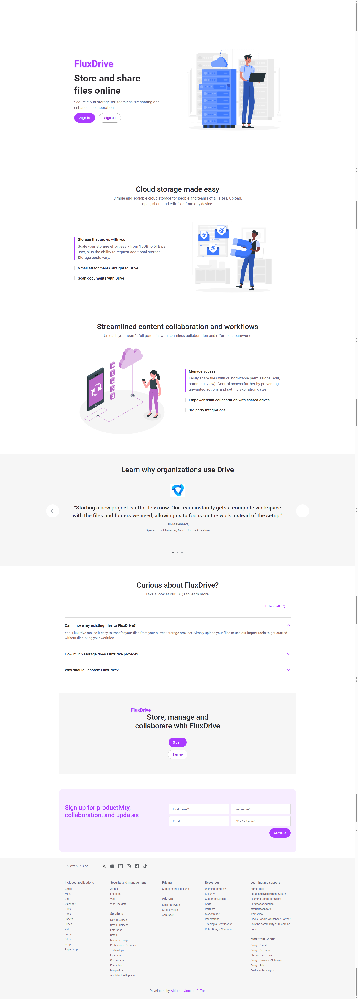
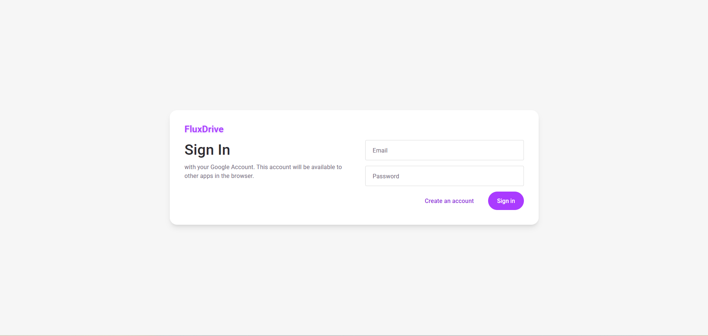
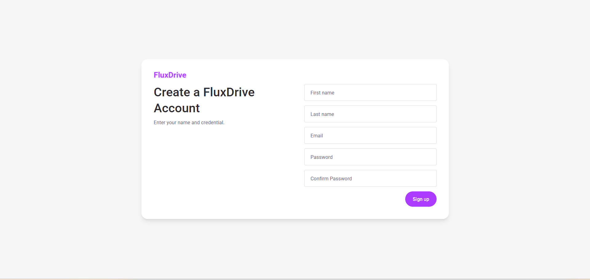
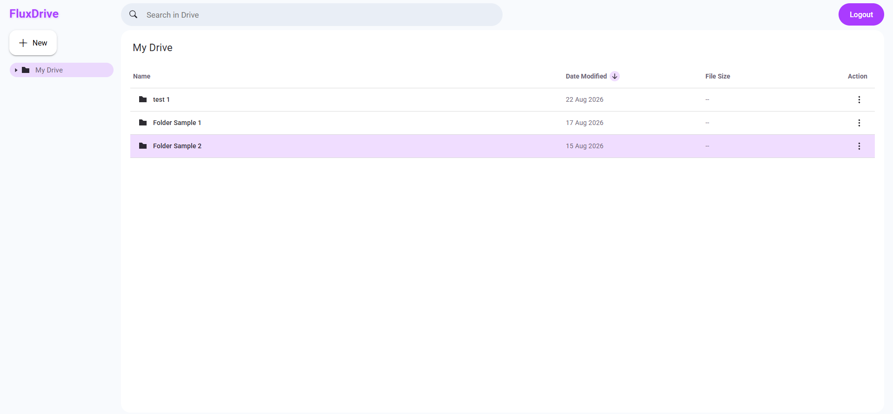

# FluxDrive

FluxDrive is a cloud-based file management application inspired by services such as Google Drive. It allows users to organize files and folders, upload and download files, search their stored content, and share folders with other users.

The application is built with **React.js** on the frontend and **Node.js/Express.js** on the backend, using **PostgreSQL** with **Prisma** for database management and **Cloudinary** for cloud file storage.

## Features

- Landing page
- User registration and login
- Authentication and protected application routes
- Create folders
- Upload individual files
- Upload entire folders
- Download files
- Delete folders
- Search for files and folders
- Share folders
- Drag and drop files
- Drag and drop folders
- File and folder organization
- Cloud-based file storage

## Screenshots

### Landing Page



### Login / Sign Up





### Application



## Tech Stack

### Frontend

- React.js
- React Router
- JavaScript
- Fetch API
- HTML
- CSS

The frontend uses **React Router** for client-side navigation and the native **Fetch API** to communicate with the backend REST API.

### Backend

- Node.js
- Express.js
- Prisma
- PostgreSQL
- Cloudinary
- Passport.js
- JWT
- Multer
- Express Validator
- bcrypt

### Backend Dependencies

| Package                   | Purpose                            |
| ------------------------- | ---------------------------------- |
| Express                   | Backend web framework and REST API |
| Prisma                    | ORM for database access            |
| PostgreSQL                | Relational database                |
| Cloudinary                | Cloud file storage                 |
| Multer                    | Handling multipart file uploads    |
| multer-storage-cloudinary | Multer integration with Cloudinary |
| Passport                  | Authentication middleware          |
| passport-jwt              | JWT authentication strategy        |
| jsonwebtoken              | Token-based authentication         |
| bcrypt                    | Password hashing                   |
| express-validator         | Request validation                 |
| file-type                 | File type detection                |
| cookie-parser             | Parsing cookies                    |
| cors                      | Cross-origin request handling      |
| dotenv                    | Environment variable management    |

### Development Dependencies

- Nodemon
- Prisma CLI

## Application Flow

```text
Landing Page
     │
     ├── Login
     │     │
     │     └── Application
     │
     └── Sign Up
           │
           └── Application
```

After authentication, users are taken to the main application where they can manage their files and folders.

## Main Application

### Folder Management

Users can create folders to organize their files and folders. Folders can also be deleted when they are no longer needed.

### File Uploads

Users can upload individual files to their current folder.

### Folder Uploads

Users can upload an entire folder while preserving its folder and file structure within FluxDrive.

### Drag and Drop

FluxDrive supports drag-and-drop interactions for both files and folders, providing an easier way to upload content and interact with the file management interface.

### File Downloads

Users can download files stored in FluxDrive directly from the application.

### Folder Sharing

Users can share folders with other users, allowing shared content to be accessed without exposing unrelated folders.

### Search

The application includes a search bar that allows users to search for files and folders.

## Architecture

FluxDrive follows a client-server architecture.

```text
┌─────────────────────┐
│     React Client    │
│                     │
│  React Router       │
│  Fetch API          │
│  UI Components      │
└──────────┬──────────┘
           │
           │ HTTP Requests
           ▼
┌─────────────────────┐
│   Node.js / Express │
│                     │
│  REST API           │
│  Authentication     │
│  Validation         │
│  File Uploads       │
└──────────┬──────────┘
           │
      ┌────┴─────────┐
      ▼              ▼
┌───────────┐  ┌────────────┐
│ PostgreSQL│  │ Cloudinary │
│  + Prisma │  │ File Store │
└───────────┘  └────────────┘
```

### Frontend

The React frontend is responsible for the user interface and client-side navigation.

**React Router** is used to handle application routes, while the native **Fetch API** is used to communicate with the backend.

### Backend

The Node.js backend uses **Express.js** to provide the REST API.

The backend handles:

- Authentication
- User registration and login
- Authorization
- File and folder operations
- File uploads
- File downloads
- Folder uploads
- Folder sharing
- Search
- Request validation
- Database operations

### Database

**PostgreSQL** is used to store application data, while **Prisma** provides the ORM layer between the Node.js application and the database.

Database records contain information such as users, folders, files, and sharing relationships.

### File Storage

**Cloudinary** is used to store uploaded files. The backend handles file uploads using Multer and stores the resulting file information and metadata in the database.

## Authentication

FluxDrive uses token-based authentication.

The backend uses:

- Passport.js
- passport-jwt
- JSON Web Tokens
- HTTP cookies
- bcrypt

Passwords are hashed with bcrypt before being stored.

Protected API routes require an authenticated user, and authorization checks are performed before allowing users to access or modify their files and folders.

## Project Structure

A simplified project structure looks like this:

```text
FluxDrive/
├── frontend/
│   ├── src/
│   │   ├── components/
│   │   ├── pages/
│   │   ├── hooks/
│   │   ├── services/
│   │   ├── types/
│   │   ├── utils/
│   │   ├── App.jsx
│   │   └── main.jsx
│   └── package.json
│
├── backend/
│   ├── src/
│   │   ├── controllers/
│   │   ├── middleware/
│   │   ├── routes/
│   │   ├── services/
│   │   └── utils/
│   ├── prisma/
│   │   └── schema.prisma
│   └── package.json
│
├── screenshots/
│   ├── landing-page.png
│   ├── login.png
│   ├── signup.png
│   └── app-page.png
│
└── README.md
```

> The exact directory structure may differ depending on the current implementation.

## Getting Started

### Prerequisites

Make sure you have the following installed:

- Node.js
- npm
- PostgreSQL
- A Cloudinary account

### Clone the Repository

```bash
git clone <repository-url>
cd FluxDrive
```

## Frontend Setup

From the project root:

```bash
cd fluxdrive
npm install
npm run dev
```

The frontend development server will start using the configured Vite development script.

## Backend Setup

Open another terminal and navigate to the backend directory:

```bash
cd backend
npm install
```

Start the backend development server:

```bash
npm run dev
```

If Nodemon is configured in the project, it will automatically restart the server whenever backend source files are changed.

## Environment Variables

The backend requires environment variables for the database, authentication, and Cloudinary configuration.

Create a `.env` file in the backend directory:

```env
DATABASE_URL=your_postgresql_connection_string

JWT_SECRET=your_jwt_secret

CLOUDINARY_CLOUD_NAME=your_cloudinary_cloud_name
CLOUDINARY_API_KEY=your_cloudinary_api_key
CLOUDINARY_API_SECRET=your_cloudinary_api_secret
```

Do not commit your `.env` file to version control.

## Database Setup

After configuring the database connection, generate the Prisma client:

```bash
npx prisma generate
```

Run the appropriate Prisma database migration commands for your environment.

## Running the Application

The frontend and backend should be running simultaneously.

### Frontend

```bash
cd fluxdrive
npm run dev
```

### Backend

```bash
cd backend
npm run dev
```

The React frontend communicates with the Node.js/Express backend through its REST API.

## Future Improvements

Potential improvements for FluxDrive include:

- File previews
- Trash / recycle bin
- File versioning
- Storage usage indicators
- User profile management
- Activity history

## License

This project is for educational and portfolio purposes.
